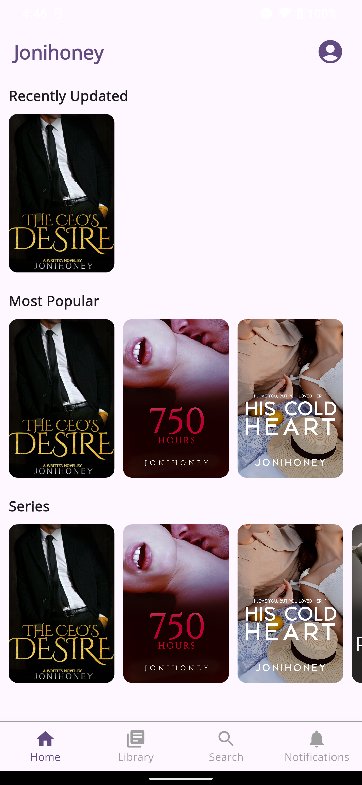
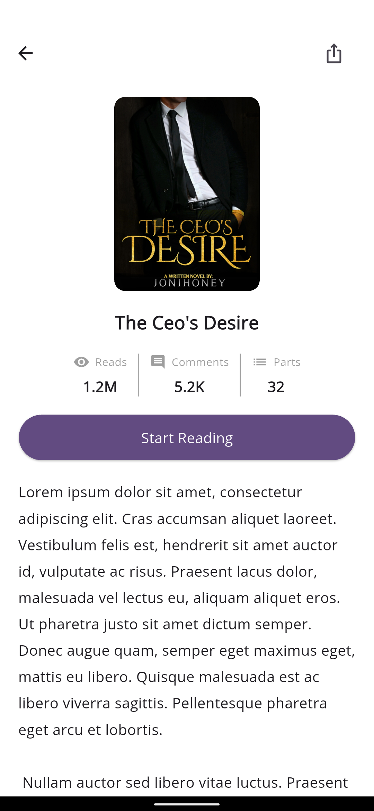
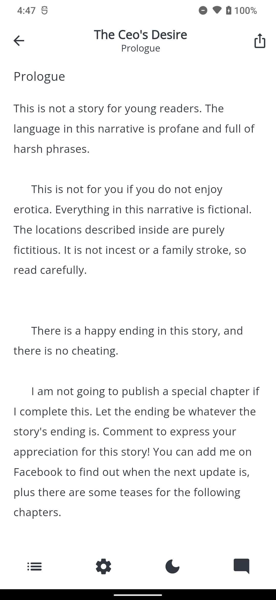
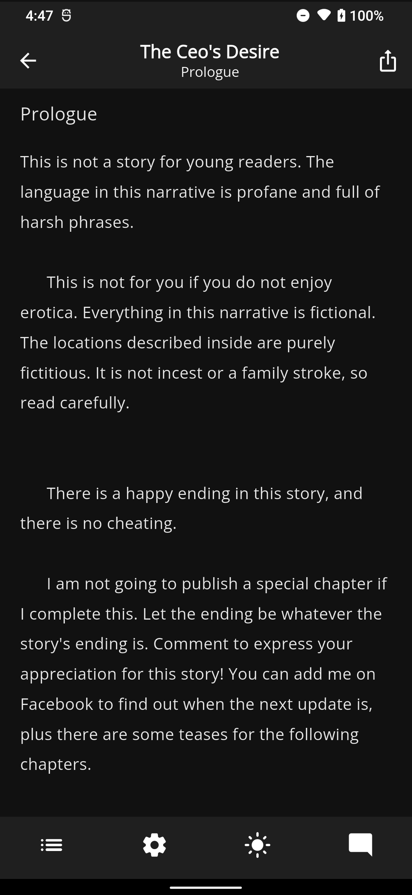
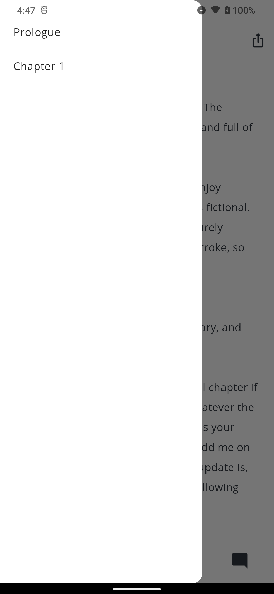
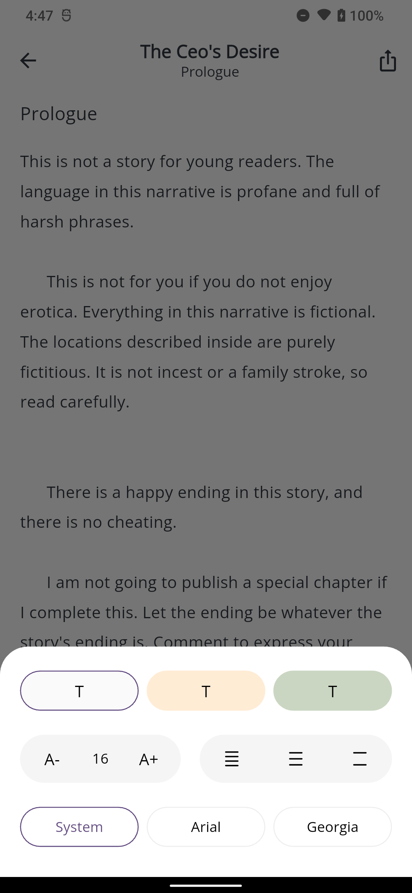
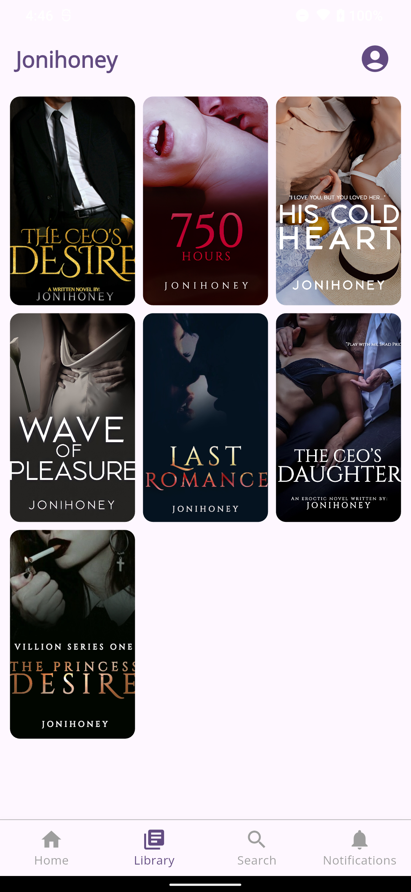
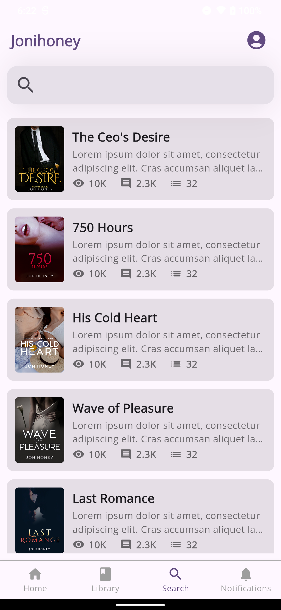

# Jonihoney Reading App

This is a Flutter application designed for a jonihoney to manage and promote her written works. It provides a dedicated space for the author to showcase their books, track reader engagement, and connect with their audience. The app offers a clean and intuitive user interface to make the reading journey more enjoyable and organized for fans.

# Technologies Used
Flutter: The primary framework for building a cross-platform mobile application.

# Screenshots

